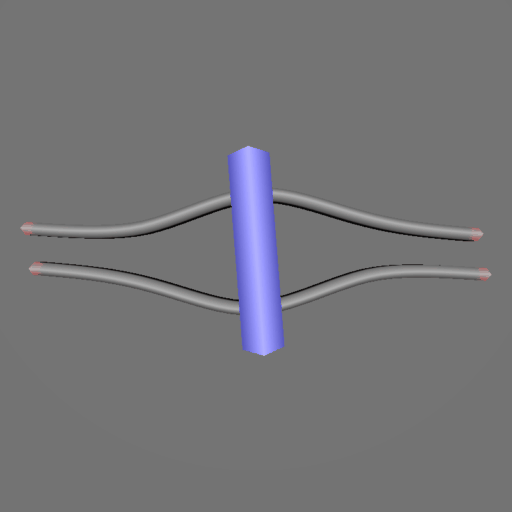

# Rendering Rods: for rendering semi flexible rod simulations.

This is a program that is designed to reding frames from a simulation.
The simulation writes the data to dat files and this program reads the
dat files and creates a 3D representation

## opengl + glfw

The rendering is done using opengl with glfw. 
